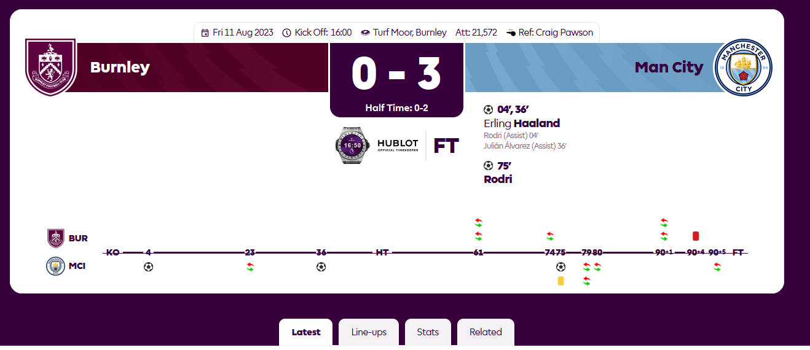
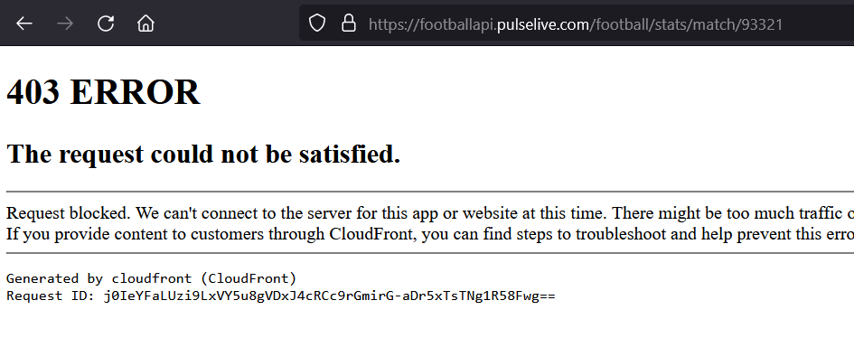
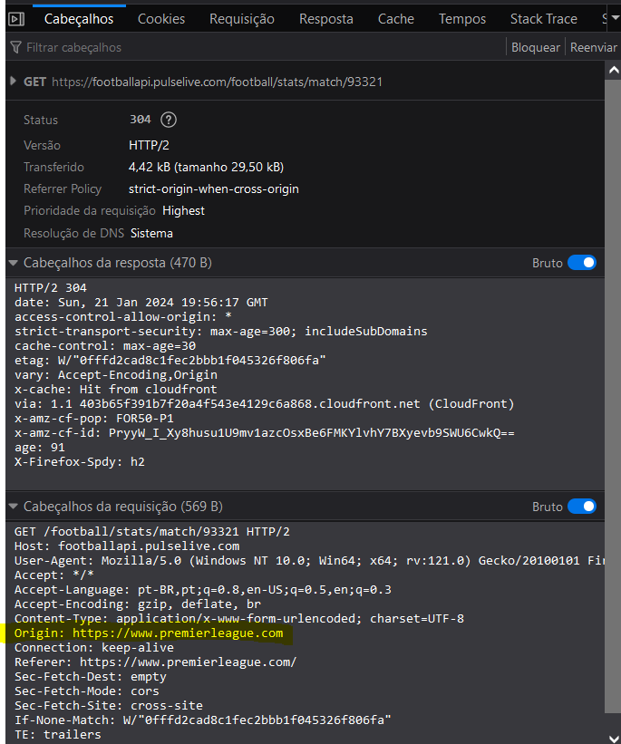
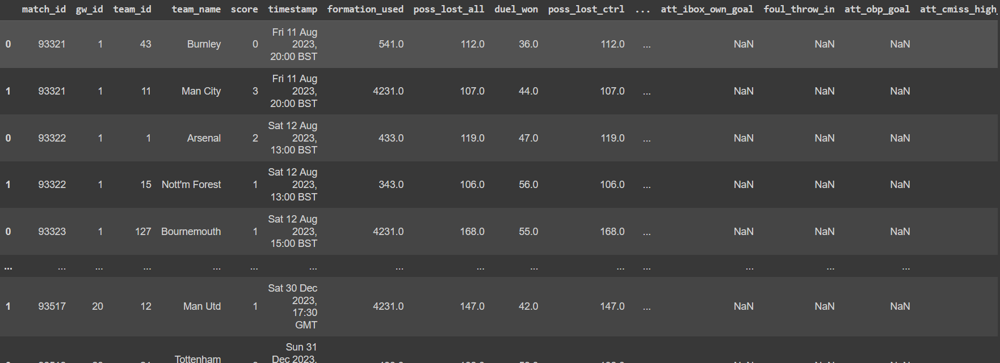

# Webscrapping Premier League (Python)

Este repositório contém o arquivo em Jupyter Notebook de funções em Python que fazem o webscrapping e limpeza de estatísticas dos jogos da Premier League. Em síntese, elas executam uma _request_ para a API que disponibiliza os dados para o próprio site da liga, executa a limpeza de metadados da partida e das estatísticas de cada time. Ao final do temos um _loop_ que corre por uma lista de partidas (ver mais informações logo abaixo) e vai executando a coleta. Os dados são armazenados num objeto tipo DataFrame e podem ser facilmente exportados para um CSV usando a biblioteca pandas.

Esse repositório é a versão em Python de um outro repositório feito em R. Para acessar ele, clique [aqui](https://github.com/arjona-jonas/webscrapping-PL).

## Bibliotecas utilizadas

É possível rodar todo o script dentro do [Google Colab](https://g.co/kgs/XtyCBbi) sem a necessidade de instalar bibliotecas a parte. Mas caso seja necessário rodar em outro ambiente, precisamos apenas instalar o pandas. O as soliticações são feitas através do módulo _requests_ e a conversão das respostas é feito usando o módulo _json_, ambos nativos do Python. Para instalar o pandas, execute o código abaixo.

```python
pip install pandas
```

## Entendendo o site da Premier League

O site da Premier League é muito interativo e dinâmico, com pouco conteúdo presente diretamente na página. Abaixo vemos a tela da primeira partida da temporada 23/24.



Na aba "Stats" estão presentes algumas das estatísticas que desejamos coletar.


Escaneando o HTML da página vemos que essas informações são dinamicamente coletadas através de _requests_ feitas para uma API ao clicarmos na aba "Stat". Ao tentar entrar no link das requests obtemos um erro 403, indicando que há algum bloqueio ao acesso aos dados.



Esse erro surge quando não estamos autorizados a fazer esse tipo de coleta diretamente. Uma solução é colocar dentro do corpo da _request_ o parâmetro "origin" como exatamente igual ao especificado na _request_ observada no DevTools (F12) do navegador. Essa especificação é feita nas funções de coleta elaboradas abaixo.



## Funções de coleta
Foram criadas quatro funções:
* `request_match_pl` faz a requisição à API;
* `clean_match_info` e `clean_match_stats` limpam, respectivamente, os dados da partida e as estatísticas de cada time;
* `scrape_match` executa tudo simultamente e cria o objeto DataFrame final.

### Requisição
Fazemos a solicitação à API, não esquecendo de colocar o parâmetro "origin" como o domínio da Premier League.

```python
def request_pl_match(url):
  r = req.get(url,headers={'origin':'https://www.premierleague.com'})
  conteudo = json.loads(r.content)
  return conteudo
```

### Limpeza da response
A _response_ que obtemos é um arquivo JSON com múltiplos aninhamentos. Os metadados da partida estão armazenados na chave "entity", enquanto que as estatíticas estão na chave "data". Por isso dividimos o tratamento em duas etapas que são unidas na função final `scrape_match`.

```python
#limpa json de info
def clean_match_info(response):
  gw = [response['entity']['gameweek']['gameweek']]
  id = [response['entity']['id']]
  info_teams = [[i['team']['id'],i['team']['shortName'],i['score']] for i in response['entity']['teams']]
  info_kickoff = [response['entity']['kickoff']['label']]
  clean_info = pd.DataFrame([id+gw+i+info_kickoff for i in info_teams],
                            columns = ['match_id','gw_id','team_id','team_name','score','timestamp'])

  return clean_info

#limpa json de dados
def clean_match_stats(response):
  stats = [response['data'].get(i)['M'] for i in response['data']]
  team_id = [i for i in response['data']]

  stats_team_a = {i['name']:i['value'] for i in stats[0]}
  stats_team_b = {i['name']:i['value'] for i in stats[1]}

  stats_team_a['team_id'] = int(team_id[0])
  stats_team_b['team_id'] = int(team_id[1])

  stats_final = pd.DataFrame([stats_team_a,stats_team_b])

  return stats_final
```

### União dos dados

```python
def scrape_match(match_to_scrape):
  conteudo = request_pl_match(match_to_scrape)

  match_info = clean_match_info(conteudo)
  match_stats = clean_match_stats(conteudo)

  full_match_data = pd.merge(match_info,match_stats,on='team_id')

  return full_match_data
```

## _Loop_ da coleta para várias partidas
Primeiro, criamos um DataFrame do pandas vazio que servirá para juntarmos todas as coletas num objeto só conforme iteramos. Segundo, listamos os IDs das partidas, obtidos simplesmente gerando uma lista começando no ID da primeira partida da temporada e indo até o ID da partida mais recente. Terceiro, amarramos tudo num _loop_ que correrrá pelos IDs das partidas e fará as coletas. Quarto, usamos uma estrutura com _try_ e _except_ para lidarmos com os casos onde, apesar da partida ter um ID menor do que de outras partidas que já ocorreram, o jogo ainda não aconteceu (seja por cancelamentos, seja por [eventos espetaculares](https://www.eurosport.com/football/premier-league/2022-2023/premier-league-postpones-weekend-fixtures-as-britain-mourns-death-of-queen-elizabeth-ii_sto9135070/story.shtml:target="_blank").

```python
df_pl_data_gw21 = pd.DataFrame()

ids = list(range(93321, 93520))

for id in ids:
  url = 'https://footballapi.pulselive.com/football/stats/match/' + str(id)
  try:
    df_pl_data_gw21 = pd.concat([df_pl_data_gw21,scrape_match(url)])
  except:
    continue
```

## Exportando o CSV e o nome das estatísticas

```python
# salvando arquivo em csv
df_pl_data_gw21.to_csv('pl_data.csv',index=False)

# salvando arquivo em txt com o nome das colunas obtidas
columns = list(df_pl_data_gw21.columns)

with open('cols.txt',mode='w',encoding='utf-8') as cols:
  for i in columns:
    cols.write(f'{i}\n')
```

## O resultado
Da forma que propusemos a coleta, obteremos objeto de tipo DataFrame da biblioteca pandas onde cada linha contém as estatísticas de um time de um jogo específico. Ou seja, para cada partida temos duas linhas no DataFrame.



É importante mencionar que nos casos onde não há uma determinada estatística para um time numa partida obteremos um NaN que precisa ser tratado como bem entendermos (removendo, imputando zero, etc.)

## Contato

* GitHub: [Jonas Arjona](https://github.com/arjona-jonas)
* E-mail: arjonagv99@gmail.com
* Linkedin: [Jonas Arjona](https://www.linkedin.com/in/jonas-arjona/)
